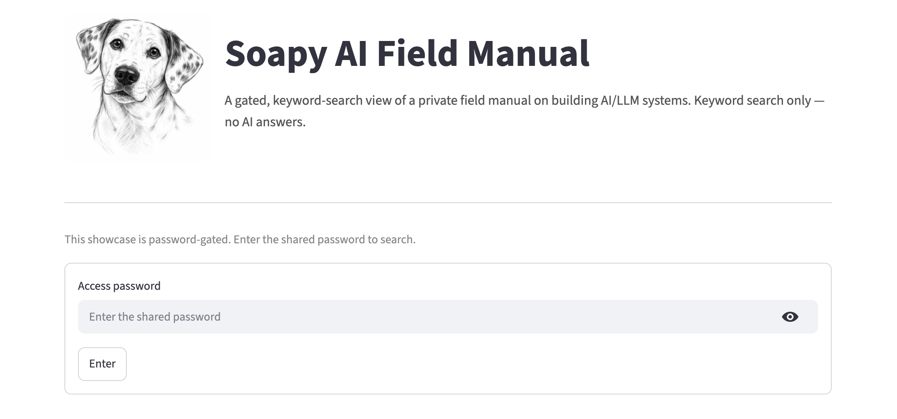
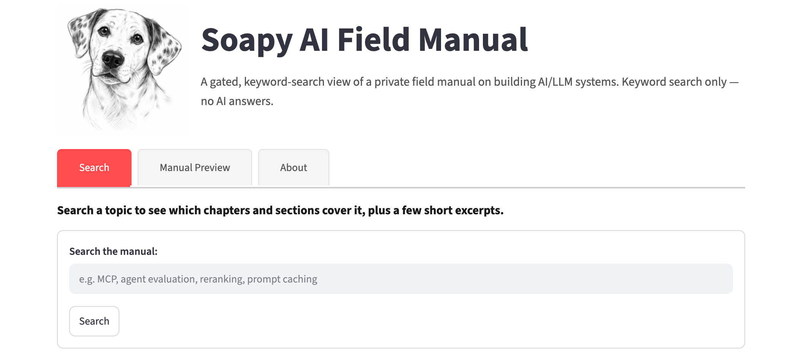
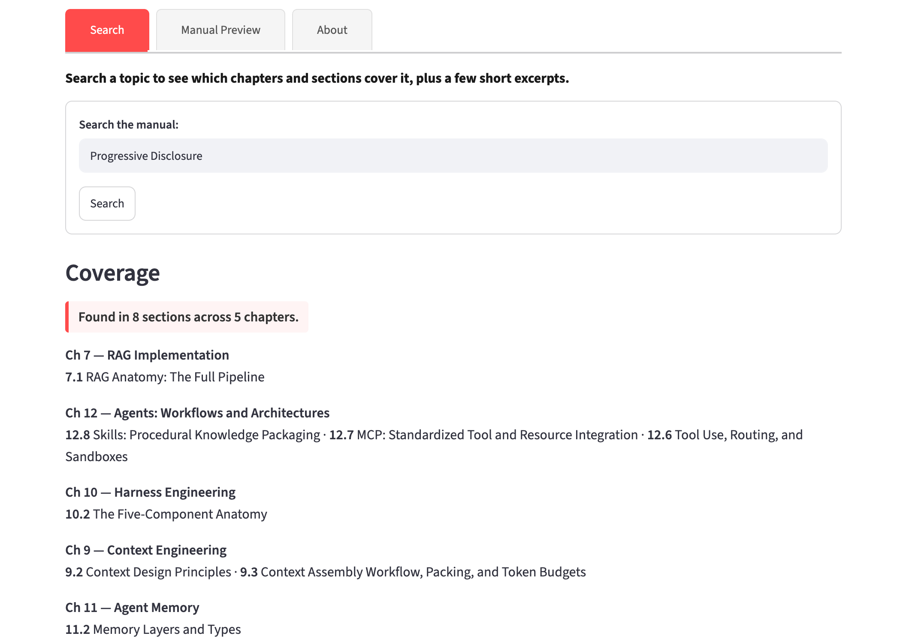
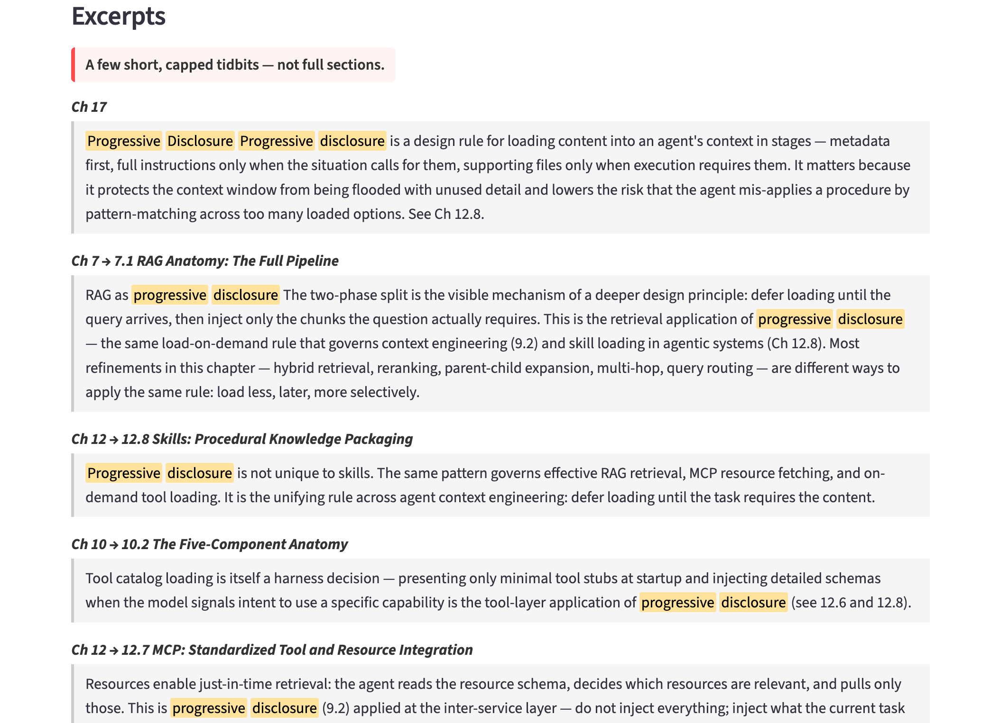
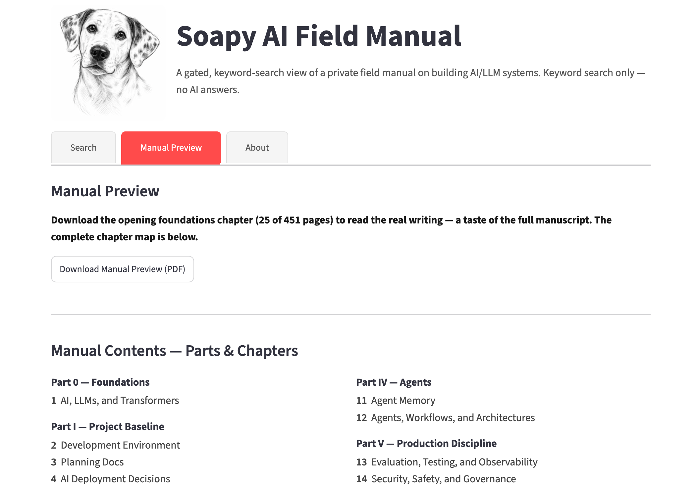
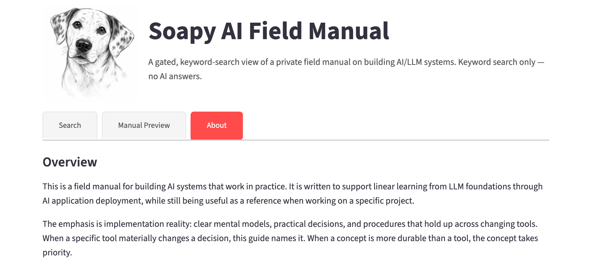

# Soapy AI Field Manual — Search

A gated, keyword-search interface to the **Soapy AI Field Manual**: a personal, implementation-first field manual for building AI/LLM systems end-to-end.

The manual itself is a private work in progress. This app exists to answer questions for anyone curious about it — *"does the manual cover \<topic\>, and how deeply?"* — without handing over the manuscript. The user searches a topic; it returns **where** the manual covers it (the relevant chapters and sections) and a few short excerpts as a taste of the prose.

## Live Search Application
https://soapy-ai-field-manual-search.streamlit.app ***(password-gated — access shared on request)***



### → [User Interface — Screenshots](#screenshots)
*The gated search UI: coverage-first results, capped excerpts, and the Manual Preview tab.*

### → [Technical Reference (PDF)](docs/saifm_technical_reference.pdf)
*Full system reference — architecture, component deep-dives, data reference, operations.*

---

## What it does

Every search returns two layers, **coverage first**:

1. **Coverage** — the chapters and sections that address your topic, by number and title. For example, a search for *evaluation* surfaces *Ch 13 → 13.3 RAG Evaluation, 13.4 Agent Evaluation, 13.5 LLM-as-Judge*. This is the primary value: it shows the manual's structure and depth at a glance.
2. **Tidbits** — a few short, capped, term-highlighted excerpts drawn from those sections, so you can read a little of the actual writing.

Leading with structure is deliberate. The table of contents is the strongest summary of what the manual is, and it keeps the prose itself rationed.

This is **not** an AI Q&A app. There is no model in the loop — no generated answers, no summarization, no embeddings. It is exact keyword search over a single corpus.

---

## What the manual covers

The manual runs from LLM foundations through deployment and operations:

| Part | Chapters |
| --- | --- |
| **0 — Foundations** | 1. AI, LLMs, and Transformers |
| **I — Project Baseline** | 2. Development Environment · 3. Planning Docs · 4. AI Deployment Decisions |
| **II — RAG: Knowledge Intake + Retrieval** | 5. Data Ingestion · 6. RAG Alternatives · 7. RAG Implementation |
| **III — Controlling the Model** | 8. Prompt Engineering · 9. Context Engineering · 10. Harness Engineering |
| **IV — Agents** | 11. Agent Memory · 12. Agents, Workflows, and Architectures |
| **V — Production Discipline** | 13. Evaluation, Testing & Observability · 14. Security, Safety & Governance · 15. Deployment & Operations |
| **VI — Adapting the Model** | 16. Fine-Tuning |
| **VII — Appendices** | 17. Glossary · 18. Planning Docs Examples |

Each chapter carries the manual's depth down to numbered sections (e.g. *12.7 MCP*, *11.4 Memory retrieval and injection*, *7.4 Reranking*) — which is exactly what the coverage layer exposes.

---

## How it works

A small, deliberately minimal stack:

- **Search** — SQLite **FTS5** (full-text search, BM25 ranking, term highlighting) via the Python standard library. No external search service.
- **Index** — the corpus is split into `chapter → section → paragraph` units and indexed in memory at startup. The corpus is tiny (one manual), so a rebuild is instant and never stale.
- **UI** — a single **Streamlit** app: a password gate, a search box, and the two-layer result.
- **Corpus pipeline** — the manual is authored separately and compiled to a single snapshot by an upstream build step; that snapshot is the only input this app reads. The app never sees the live chapter files.

```
manual (private repo)  →  compiled snapshot  →  FTS5 index  →  gated search UI
```

---

## Content & access

- **Single shared password.** No accounts, no per-user identity — access is shared deliberately with people who ask.
- **The manuscript stays private.** The full prose is never committed to this repository and never sent whole to the browser. Searches return only the coverage labels and a few capped excerpts (a small character limit per excerpt, a small number of excerpts per query, no browsing, no pagination, no "show full section").
- **Honest about its limits.** Anything rendered in a browser can be copied; these measures make casual copying low-value and bulk extraction slow. That trade-off is accepted on purpose — the goal is a showcase, not DRM.

---

## Tech stack

`Python` · `Streamlit` · `SQLite FTS5` (stdlib `sqlite3`) · no LLM, no inference, no external search service. (On the hosted demo the gitignored corpus is fetched once at startup from a private repo — see *Content & access*.)

---

## Status

**Live.** The gated app (Search · Manual Preview · About) is deployed on Streamlit Community Cloud at the link above — access shared on request. The corpus and preview are fetched privately at startup, so nothing proprietary lives in this repo. Remaining: a small `pytest` suite and optional polish.

---

## Docs

| Doc | What it is |
| --- | --- |
| [Technical Reference (PDF)](docs/saifm_technical_reference.pdf) | Full system reference — architecture, component deep-dives, data reference, operations |
| [overview.md](docs/overview.md) | Intent, boundaries, and the locked architecture decisions |
| [prd.md](docs/prd.md) | Requirements (Must / Should / May) and the content-protection model |
| [data_inventory.md](docs/data_inventory.md) | The corpus, the format contract, and refresh cadence |
| [eval_plan.md](docs/eval_plan.md) | How search quality and content protection are measured |

These planning docs follow the methodology the manual itself teaches in *Chapter 3 — Planning Docs*.

---

## Screenshots

### Search — coverage first
A topic query answers *"where does the manual cover this?"* before showing any prose.



### Coverage — matching sections, grouped by chapter
The headline result: every matching chapter and section, by number and title — the manual's table-of-contents depth at a glance.



### Excerpts — a capped, highlighted taste
Beneath coverage, a few short, term-highlighted excerpts — hard-capped, never a full section.



### Preview of Soapy AI Field Manual 
A downloadable sample of the first 25-pages of the actual manuscript (TOC and Chapter 1).



### About
The manual's overview and intent.



---

## License

See [LICENSE](LICENSE).
